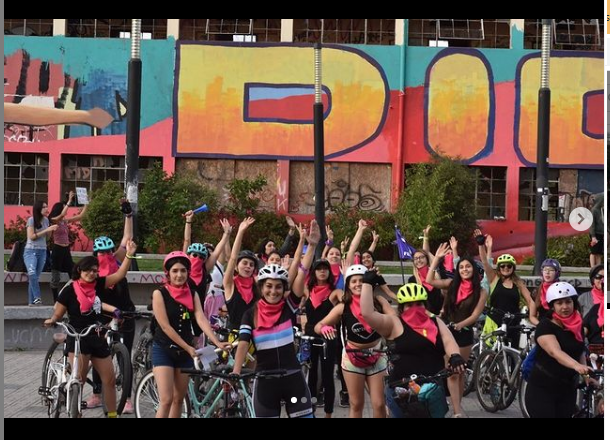
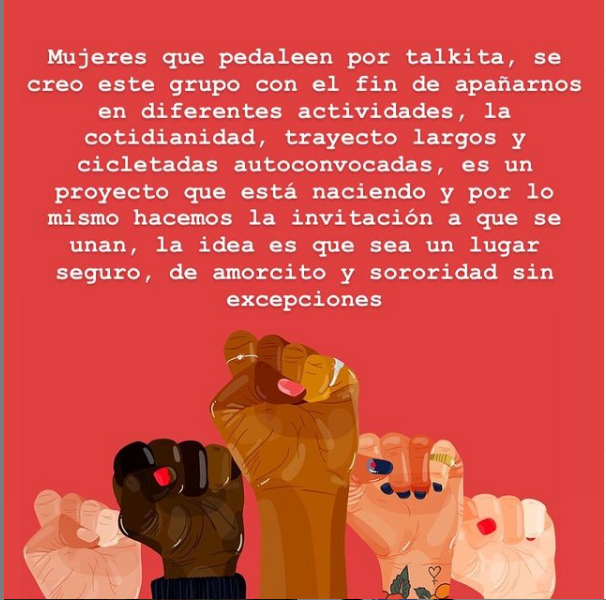
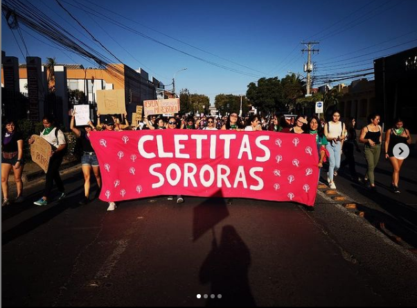
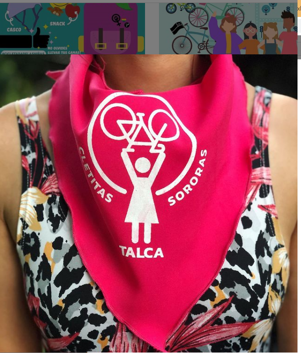
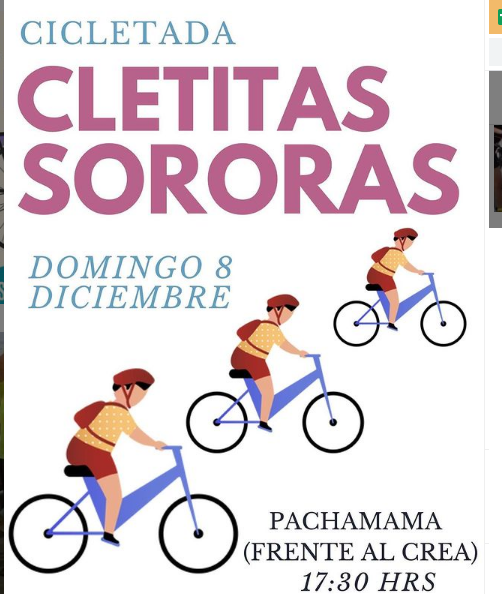
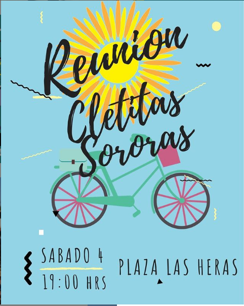

#### FOLIO: TAL20
# Cletitas Sororas

[instagram](https://www.instagram.com/cletitasororas/)
[facebook]()
[twitter]()
<correo@correo.cl>
---

### Representantes
#### (Nombres o emails de voceros o representantes).

---
### Interacciones frecuentes
#### Las hijas del trueno, colectivo feminista 8M
### Redes sociales
#### ¿Para qué se utiliza la red social?
| Instagram | Facebook | Twitter | Otra 
|---|---|---|---|
|Difusión de información y actividades. Mural de fotografías para registrar las actividades concretadas|0|0| 0|

### **Instagram**
| seguidores | seguidos | publicaciones | hashtag 
|---|---|---|---|
|1382|220|39| #justiciaparaantonia #martinpradenasviolador

---

* **Actividad:**   Discontinua por la pendemia del COVID-19

* Primera Publicación IG 27 de septiembre del 2019

---
### Frecuencia de publicación.

Publicaciones: Semanales de 2 a 3 hasta marzo.

Actividades: semanales hasta Julio de 2020 

---
### Ubicación
* Sector de la comununa/ciudad: Plaza Las Heras, Plaza cienfuegos/ Talca en general.

---
### Describir temas de interés y/o trabajo
#### Colectivo de mujeres ciclistas interesadas en el feminismo (separatista), la apropiación del espacio publico y la convivencia y fortaleciendo de lazos entre mujeres. .
---
### Describir la imagen ideal por la cual se trabaja.
#### "Nunca mas solas" "Porque la culpa no era nuestra, ni donde estábamos, ni como vestíamos, el violador eres tú." "LA REVOLUCIÓN SERÁ FEMINISTA O NO SERÁ" 

---
### ¿Que se hace?
#### 
- Realiza reuniones en espacio públicos y
 - cicletadas (protestas) 
- Cicletadas para niñas (Actividad no separatista) 

## Video de propaganda: [Link Instagram](https://www.instagram.com/p/B7Gds5JJFhJ/)

---
### Describir y distinguir demandas más reivindicativas de espacios sin relación con lo contencioso o con lo político mas prefigurativo
#### Invita a mujeres ciclista a agruparse para construir espacios de sororidad/ Transformación cotidiana del uso del espacio publico 

---
### Tipo de organización interna.
#### Vocería y horizontalidad. No de distingue su estructura organizativa.

---
### Describir los temas / imágenes- iconos / conceptos mas habitualmente presentes en sus publicaciones. Describir cambios/ transformaciones en los contenidos desde Octubre.

**Iconos:**

**Banderas:** 

**Diseño estético:**

> Utilizan el color rojo como color distintivo. Sus principales figuras son la bicicleta y el puño en alto. 

---
### Percepciones que se tiene del Estado
#### (Aparato burocrático)
> No se identifica

| Declaraciones | infografía | 
|---|---|
|Anotar los comunicados |  |

---
### Percepciones que se tiene de las Fuerzas de Orden
#### No se identifica
>   

| Declaraciones | infografía | 
|---|---|
|Anotar los comunicados |  |

---
### 