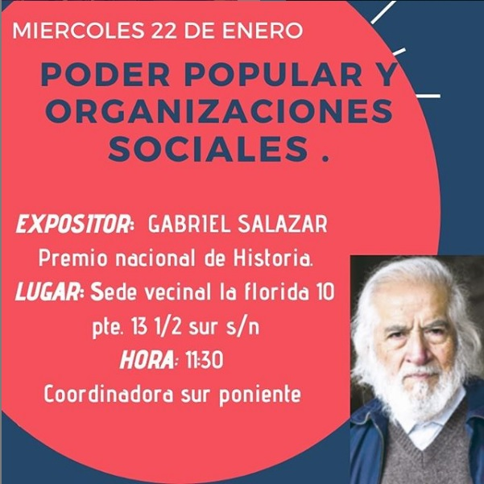
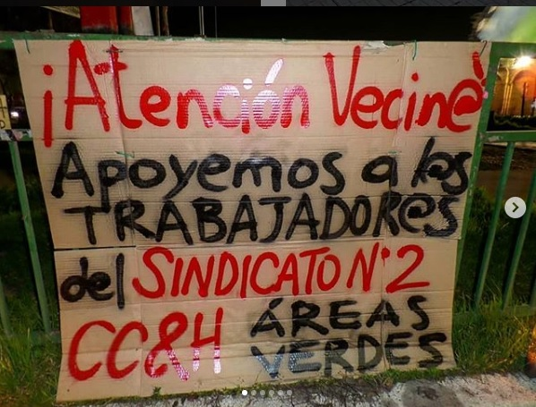
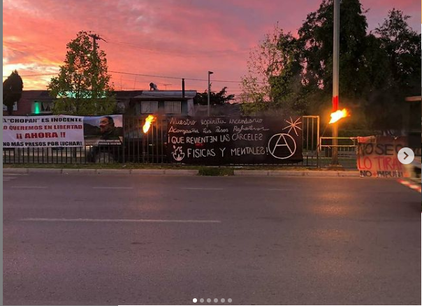
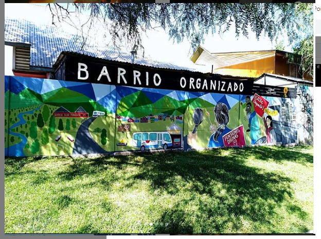
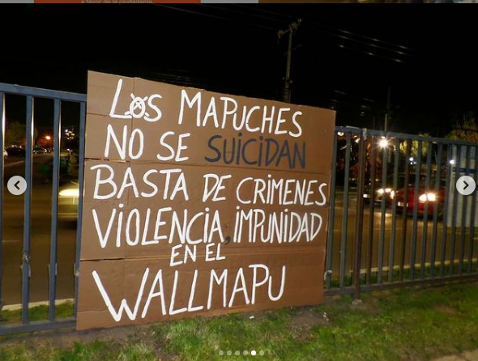
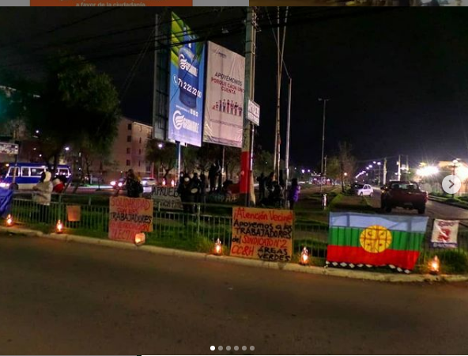
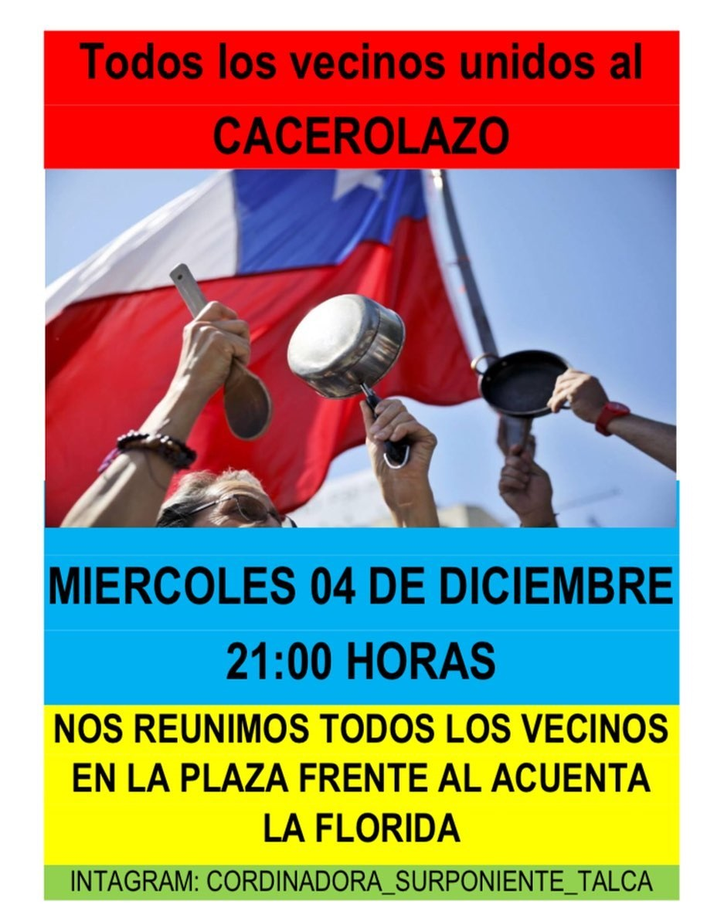
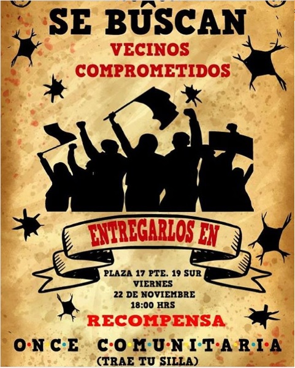
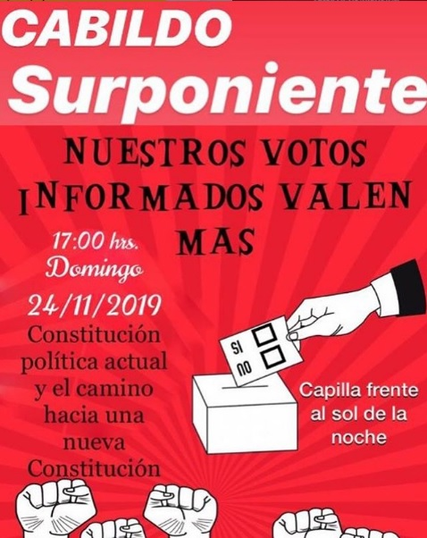
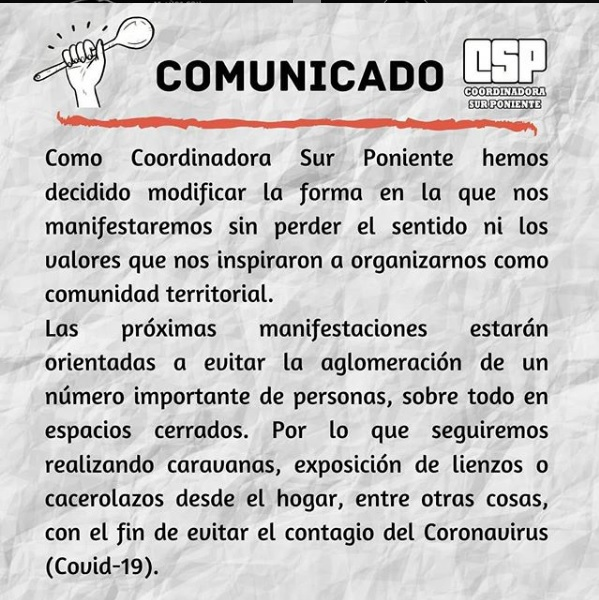

#### FOLIO: TAL2
# Coordinadora Sur Poniente Talca

[instagram](https://www.instagram.com/coordinadora_surponiente_talca/)
[facebook](https://www.facebook.com/Coordinadora-sur-poniente-Talca-101158091431332/)
[twitter]()
<c.surponiente@gmail.com>
---

### Representantes
#### (Nombres o emails de voceros o representantes).

---
### Interacciones frecuentes
#### (listar otras organizaciones que habitualmente)

### Redes sociales
#### ¿Para qué se utiliza la red social?
| Instagram | Facebook | Twitter | Otra 
|---|---|---|---|
|Difusión de información y actividades y mural de fotografías de actividades realizadas |Difusión de información y actividades y mural de fotografías de actividades realizadas|0| 0|

### **Instagram**
| seguidores | seguidos | publicaciones | hashtag 
|---|---|---|---|
|2496|132|192| 0

---

* **Actividad:**   Continua

* Primera Publicación IG:  19 de noviembre de 2019

---
### Frecuencia de publicación.

Publicaciones:Diaria de Noviembre a febrero. Semanal desde Marzo de 2020.

Actividades: Actividades semanales constantes, en periodo de pandemia mensuales. Retoman presenciales en noviembre del 2020. 

---
### Ubicación
* Sector de la comununa/ciudad: Sector Sur poniente de Talca/ concentraciones en 18 sur con avenida Colín.

---
### Describir temas de interés y/o trabajo
#### Organización territorial que se dedica a la coordinación de asambleas de diversas temáticas de interés como feminismo, rol del estado y proceso constituyente, medio ambiente. Trabaja en conjunto a otras organizaciones. Organización de protestas en la vía publica como cacerolazos, velatones o cortes de calle pacíficos. 
---
### Describir la imagen ideal por la cual se trabaja.
#### ¡Todas y todos a crear comunidad!,        "Por que el pueblo ayuda el pueblo, seguimos construyendo una comunidad organizada"  Sociedad feminista, antifascista, anti patriarcal y anticapitalista.  

---
### ¿Que se hace?
#### 
- Actividades comunitarias como: 
    - Cabildos, 
    - onces comunitarias, 
    - conversatorios, 
    - talleres de reciclaje. 
- Manifestaciones publicas como: 
    - cacerolazos,
    -  Ferias de trueque, difusión de información, 
    - caravanas de autos, 
    - velatones, cortes de calles, 
    -  muralismos comunitarios. 
-  Charlas y conversatorios.  

---
### Describir y distinguir demandas más reivindicativas de espacios sin relación con lo contencioso o con lo político mas prefigurativo
#### 

---
### Tipo de organización interna.
#### Asambleísmo, nace desde un conjunto de cabildos organizados en el sector sur poniente. 

---
### Describir los temas / imágenes- iconos / conceptos mas habitualmente presentes en sus publicaciones. Describir cambios/ transformaciones en los contenidos desde Octubre.

**Iconos:**

**Banderas:**

**Diseño estético:**

> La estética varia durante el tiempo, los afiches son hechos por distintas personas y su logo definitivo se visualiza en enero del 2020. Los colores utilizados son muy diversos. 

---
### Percepciones que se tiene del Estado
#### (Aparato burocrático)
> resumen de lo encontrado

| Declaraciones | infografía | 
|---|---|
|Anotar los comunicados |  |

---
### Percepciones que se tiene de las Fuerzas de Orden
#### (Aparato represivo)
>Publicaión:  "En Chile hay racismo contra el pueblo mapuche, amparado por Carabineros y los poderes del Estado.
A romper el silencio contra las injusticias sociales vecinos y vecinas.
¡Amulepe Taiñ Weichan!" 

| Declaraciones | infografía | 
|---|---|
|Anotar los comunicados |  |

---
###  
